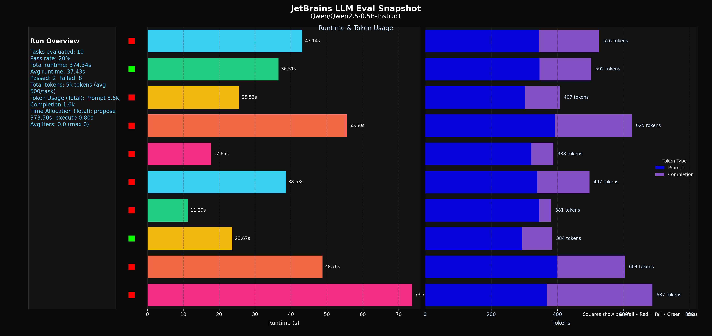
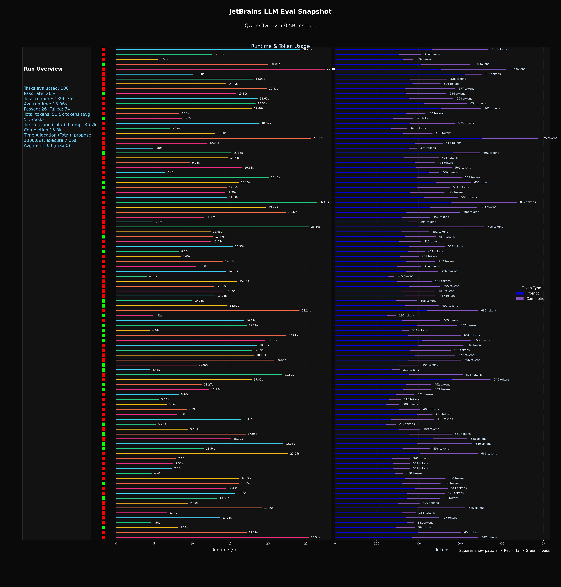
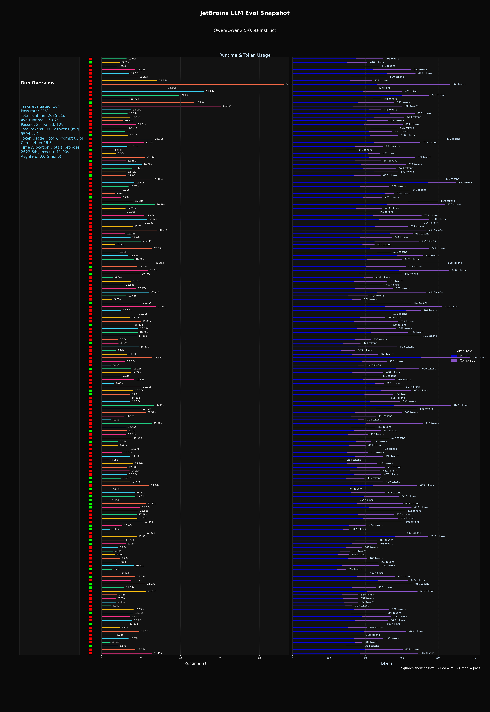
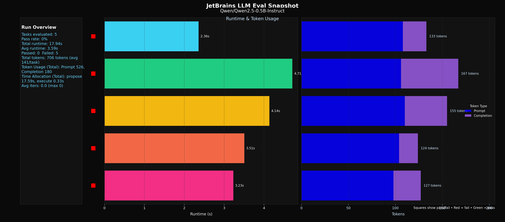

## HumanEvalFix Bug-Fixing Agent

This repository packages a LangGraph-based ReAct agent that repairs buggy Python functions from the HumanEvalFix benchmark (sourced from the BigCode `bigcode/humanevalpack` repository). The pipeline feeds each task’s specification, broken implementation, and hidden tests to an LLM, runs the code inside a sandbox, and reports pass@1.

### Key Capabilities
- ReAct-style propose → execute → (optional) reflect loop built with LangGraph, tuned for deterministic pass@1 repair attempts.
- Bug-fix aware prompting: each task includes the docstring/spec, buggy implementation, and entry point to preserve.
- Sandboxed execution (subprocess or Docker) with CPU/memory guards and strict network/file isolation.
- Streaming JSONL results for resume-friendly evaluations plus optional visualization tooling.
- Optional multi-iteration repair (`--iters`) to approximate pass@k when desired.

### Requirements
- Python 3.11 or newer.
- `transformers` and a compatible `torch` build (install the wheel for your platform before running).
- `datasets` for loading HumanEvalFix locally or from the Hugging Face Hub.

> TIP: Install a platform-specific torch build (CPU, CUDA, or ROCm) before launching the CLI so `transformers` can select the correct backend.

## Quick Start

1. **Create a virtual environment and install dependencies**

	 ```bash
	 # Recommended tooling: uv (fast Python packaging)
	 pip install uv
	 uv venv
	 source .venv/bin/activate
	 uv pip install .
	 ```

2. **Stage the HumanEvalFix dataset (recommended for offline runs)**

	 Download the parquet locally and place it at `./dataset/humaneval_py.parquet`, or supply a custom location via `--dataset-path`.

3. **Run the benchmark**

	 ```bash
	 uv run run.py \
		 --model Qwen/Qwen2.5-0.5B-Instruct \
		 --dataset-path ./dataset/humanevalfix_python.jsonl \
		 --max 5 \
		 --temperature 0.0 \
		 --out ./results/results.jsonl \
		 --verbose \
		 --visualize
	 ```

	 The command prints a JSON summary that includes pass@1, emits per-task records to `results.jsonl`, and renders a combined runtime/token PNG report when `--visualize` is supplied.

### Additional CLI Examples

```bash
# Evaluate a synthetic parquet at a higher sampling temperature and generate a visualization
uv run run.py \
	--model Qwen/Qwen2.5-0.5B-Instruct \
	--dataset-path ./dataset/bogus.parquet \
	--max 5 \
	--temperature 0.7 \
	--out ./results/bogus.jsonl \
	--verbose \
	--visualize

# Exercise the Docker sandbox (requires Docker privileges)
sudo -E env PATH="$PATH" VIRTUAL_ENV="$VIRTUAL_ENV" uv run run.py \
	--model Qwen/Qwen2.5-0.5B-Instruct \
	--dataset-path ./dataset/humanevalfix_python.jsonl \
	--max 1 \
	--out ./results/tmp_results.jsonl \
	--verbose \
	--sandbox docker

# Regenerate the visualization from an existing JSONL file
uv run python src/visualize_results.py \
	--input results/results.jsonl \
	--output results/results.png
```


## Results Snapshot

| Run | Tasks | Pass@1 | Runtime (s) | Tokens (prompt/completion) |
| --- | --- | --- | --- | --- |
| `humanevalfix_qwen25_0.5b_10.jsonl` | 10 | 20% (2 / 10) | 374.3 | 3.5k / 1.6k |
| `humanevalfix_qwen25_0.5b_100.jsonl` | 100 | 26% (26 / 100) | 1396.35 | 36.2k / 15.3k |
| `humanevalfix_qwen25_0.5b_full.jsonl` | 164 | 21% (35 / 164) | 2635.21 | 90.3k / 26.8k |





### Synthetic Sanity Benchmark

Large language models remain partial black boxes, so the project ships with a synthetic parquet (`dataset/bogus.parquet`) that is intentionally unwinnable: every task is constructed to fail regardless of the model output. Running the CLI against this split provides a fast regression check that the evaluation pipeline surfaces failures correctly and that any reported pass@1 improvements on the real Humaneval data are plausible.



## Command-Line Interface
- `--model` (str) selects the Hugging Face model ID or alias.
- `--max` (int) limits the number of benchmark problems processed.
- `--temperature` (float) controls sampling randomness; defaults to deterministic `0.0`.
- `--out` (path) writes per-task JSONL results to disk.
- `--iters` (int) enables optional repair iterations beyond the first execution (default 0 for pass@1, other values for pass@k metric).
- `--sandbox {process,docker}` switches between the local subprocess sandbox and a Docker-based variant.
- `--resume` resumes from a prior results file, skipping already-completed tasks. Results are appended after each benchmark item, so interrupted runs can be restarted without rework.
- `--visualize` renders an aggregated PNG report once evaluation finishes.
- `--verbose` and `--debug` increase logging detail for troubleshooting.

## Agent Contract
- Inputs: HumanEvalFix specification (docstring + stub), the buggy implementation to repair, hidden tests, and required `entry_point` name.
- Tooling: `run_python_with_tests(code, tests, entry_point)` executes candidate code inside the sandbox and returns pass/fail, exit code, stdout, and stderr.
- Termination: The agent stops after the first execution unless additional iterations are requested via `--iters`.

## Sandbox Overview
- Executes within a temporary directory using `python -I` for isolation and applies CPU, memory, and file-handle limits.
- Blocks outbound networking and restricts filesystem access to the sandbox workspace.
- Supports a Docker backend (`--sandbox docker`) with configurable image, CPU, memory, and PID limits via environment variables (`SANDBOX_DOCKER_IMAGE`, `SANDBOX_DOCKER_CPUS`, `SANDBOX_DOCKER_MEMORY`).
- Monitors container lifecycle via `docker events` if needed.
- Run `sudo docker events --filter type=container --format '{{.Time}}  {{.Status}}  {{.Actor.Attributes.name}}'` to stream the lifecycle of the container

## Project Layout
- `src/agent/llm.py`: lightweight Transformers chat wrapper that handles model aliases and token accounting.
- `src/agent/sandbox.py`: sandbox runners for both subprocess and Docker execution modes.
- `src/agent/react_agent.py`: LangGraph state machine coordinating propose, execute, and optional reflection.
- `src/eval/humaneval_eval.py`: evaluation harness that loads Humaneval, orchestrates the agent, and aggregates pass@1.
- `src/visualize_results.py`: matplotlib report generator using a JetBrains-inspired theme.
- `run.py`: CLI entry point tying everything together.

## Metrics and Logging
Each JSONL record contains:
- `task_id`, `passed`, `exit_code`, `stdout`, `stderr`, and `runtime_sec`.
- `iters` and `timings_sec` (proposal, execution, reflection) when reflection is permitted.
- `token_usage` capturing prompt/completion token counts for propose and reflect steps.

Run with `--verbose` to view per-task summaries or `--debug` for deeper instrumentation during agent execution and sandbox runs.

## Troubleshooting
- **Torch missing or incompatible:** Install a platform-specific wheel from https://pytorch.org/get-started/locally before invoking `run.py`.
- **CUDA unavailable:** The model automatically falls back to CPU; consider smaller models if generation is slow.
- **Dataset load timeouts:** Use `--dataset-path ./dataset/humanevalfix_python.jsonl` to bypass repeated downloads.
- **Docker permission errors:** Ensure the user can reach the Docker daemon or set `DOCKER_BIN="sudo docker"`.

## Reproducing Results
Re-run the walkthrough command with your desired `--max` count or the full dataset. Pass@1 is reported as the fraction of problems solved on the first attempt. For reproducibility, keep `temperature=0.0` and fix random seeds if you introduce stochastic sampling.
