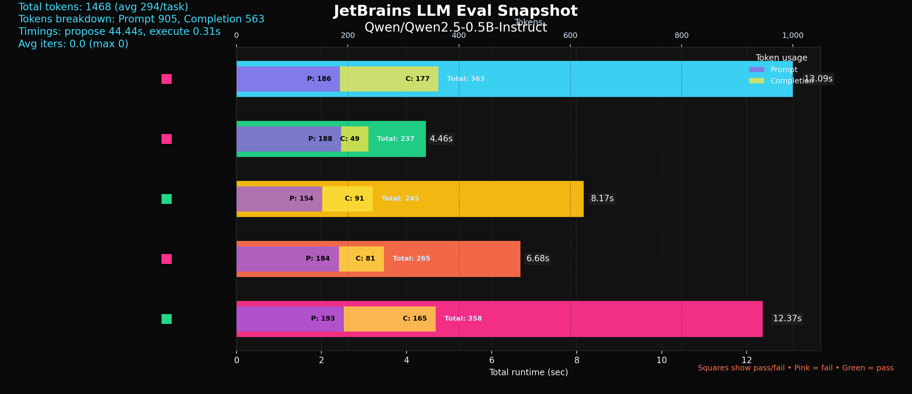

## LLM agent to fix Python code and evaluate on Humaneval (pass@1)

This repo provides a production-ready scaffold using LangGraph to run a ReAct-style agent that:

- Uses a small instruction-tuned model (default: Qwen/Qwen2.5-0.5B-Instruct) locally via Transformers
- Has a sandboxed Python “code interpreter” tool to execute unit tests safely
- Evaluates on BigCode’s `bigcode/humanevalpack` (python) using pass@1

What’s included
- `src/agent/llm.py` — lightweight local Transformers chat wrapper
- `src/agent/sandbox.py` — sandboxed subprocess runner with CPU/memory/timeout and network-block stubs
- `src/agent/react_agent.py` — LangGraph ReAct loop: propose -> execute -> reflect
- `src/eval/humaneval_eval.py` — evaluation harness for HumanevalPack, producing JSONL results and pass@1
- `run.py` — CLI to run the benchmark end-to-end

Requirements
- Python 3.13+
- transformers, torch (install a torch build suitable for your platform)
- datasets

> [!NOTE]
> Install a platform-specific torch build (CPU, CUDA, or ROCm) before running the CLI so transformers can locate the correct backend.

## Quick start

1) Create and activate a virtual environment and install deps

```bash
# Recommended: uv (fast Python packaging)
pip install uv
uv venv
source .venv/bin/activate
uv pip install -r requirements.txt
```

2) Download/copy the Humaneval dataset locally (optional but recommended)

Place it at `./dataset/humaneval_py.parquet` or pass a custom path with `--dataset-path`.

> [!TIP]
> Keeping a local parquet prevents repeated HF Hub downloads and shortens start-up time during rapid benchmarking.

3) Run the evaluation (local model + local dataset)

Execution:

```bash
uv run run.py \
	--model qwen3-0.6b \
	--dataset-path ./dataset/humaneval_py.parquet \
	--max 5 \
	--out ./results/results.jsonl \
	--verbose \
	--visualize
```

This prints a summary JSON with `pass@1`, writes per-problem results to `results.jsonl`, and renders a companion PNG chart with the same stem.

CLI run with different options:

```bash
# Evaluate against a synthetic/bogus parquet and emit a matching PNG snapshot
uv run run.py \
	--model qwen3-0.6b \
	--dataset-path ./dataset/bogus.parquet \
	--max 5 \
	--out ./results/bogus_results.jsonl \
	--verbose \
	--visualize

# Run a minimal docker-sandboxed check with environment forwarding (requires sudo)
sudo -E env PATH="$PATH" VIRTUAL_ENV="$VIRTUAL_ENV" uv run run.py \
	--model qwen3-0.6b \
	--dataset-path ./dataset/humaneval_py.parquet \
	--max 1 \
	--out ./results/tmp_results.jsonl \
	--verbose \
	--sandbox docker

# Re-generate the visualization from an existing JSONL results file
uv run python src/visualize_results.py \
	--input results/results.jsonl \
	--output results/humaneval.png
```


## Sample visualizations




## CLI options
- `--iters` optional number of repair loops after the first execute (default 0 = strict pass@1). Set to a small value like 2–3 to allow propose→execute→reflect cycles.
- `--sandbox {process,docker}` select the execution backend (`process` is the default in-process sandbox, `docker` launches a Python container using the `python:3.13-slim` image).
- `--resume` resume from an existing JSONL results file, skipping tasks that already have recorded outcomes.

Environment variables

Agent contract
- Input: `prompt` from humanevalpack, `tests`, `entry_point`
- Output: full Python implementation defining the required function(s)
- Tool: `run_python_with_tests(code, tests, entry_point)` executes in sandbox; returns pass/fail and logs
- Termination: stop when tests pass or iteration budget is exhausted

## Sandbox notes
- Runs in a temporary directory with `python -I` (isolated), enforces timeout, CPU and memory limits via `resource`
- Disables network by overriding `socket` creation in the child process
- Restricts file open calls to the sandbox folder
- For stricter isolation in production, consider a containerized runner (Docker/Firecracker) or OS-level sandboxes
- Pass `--sandbox docker` to run the candidate and tests inside a short-lived Docker container (requires Docker; honors `SANDBOX_DOCKER_IMAGE`, `SANDBOX_DOCKER_CPUS`, `SANDBOX_DOCKER_MEMORY`).
- run `sudo docker events --filter type=container --format '{{.Time}}  {{.Status}}  {{.Actor.Attributes.name}}'` to stream the lifecycle of the container

Pass@1 metric
- We generate a single candidate per task; pass@1 is the fraction of tasks whose tests pass on the first attempt.
- Strict pass@1 by default: the agent runs a single sandbox execution per task (no iterative repair). To experiment with iterative repair, pass `--iters N` to allow up to N propose→execute→reflect cycles.
- Keep `temperature=0.0` (default) for deterministic generation.

Reproducing results
Run the provided command above. Your score will depend on the model and the subset size. For a quick test, try `--max 5`.

Troubleshooting
- Transformers can't find torch: install a platform-appropriate torch build (see https://pytorch.org/get-started/locally/)
- CUDA not available: generation falls back to CPU; consider smaller models or set `device_map=auto` (default) to use GPU if present
- Dataset timeouts from HF Hub: use `--dataset-path ./dataset/humaneval_py.parquet` to bypass network

## Project structure

- `src/agent/llm.py` — lightweight local Transformers chat wrapper, supports short model aliases (e.g., `qwen3-0.6b`).
- `src/agent/sandbox.py` — sandboxed subprocess runner with CPU/memory/timeout and network-block; injects the required entry point into the test module.
- `src/agent/react_agent.py` — LangGraph ReAct loop: propose -> execute -> reflect. The assistant emits a single fenced code block; we extract and execute it.
- `src/eval/humaneval_eval.py` — evaluation harness for HumanevalPack, sequential execution producing JSONL results and pass@1.
- `run.py` — CLI wrapper for end-to-end runs.

## Metrics and logs

Per-task result objects (in `results.jsonl` and the verbose printout) include:

- `runtime_sec` — total wall time for the task (agent + sandbox).
- `iters` — number of agent reflection iterations actually used.
- `timings_sec` — per-phase breakdown (when available):
	- `t_propose_sec` — time spent in the initial LLM proposal.
	- `t_execute_sec` — cumulative time executing tests in the sandbox across iterations.
	- `t_reflect_sec` — cumulative time spent in LLM reflection cycles. Should be 0 if iters is set to 0 (Only the first trajectory is used)

When running with `--verbose`, a compact breakdown is also shown per task. Running with `--debug` also provides additional information that can be helpful for troubleshooting
